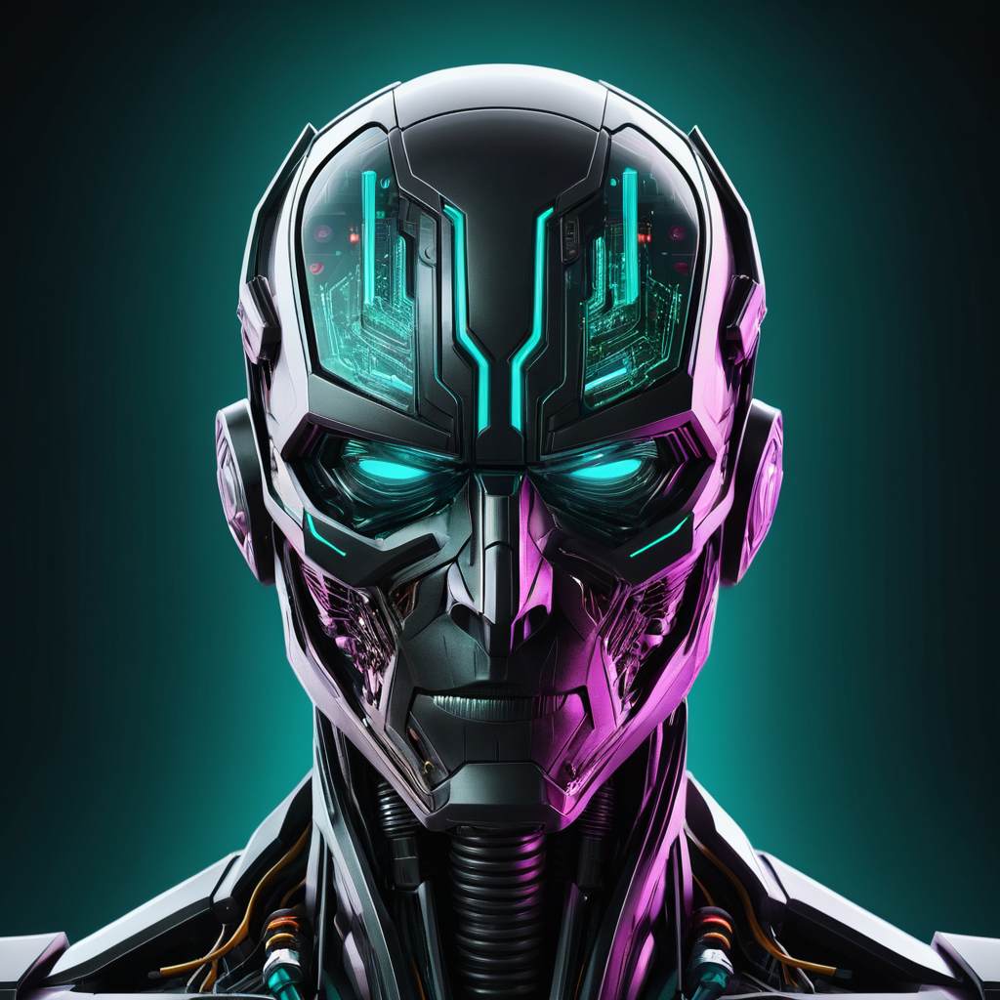

<div align="center">

# RoleForge

**A local-first AI agent harness and automation control plane.**

RoleForge brings role-based agents, model policy, RAG knowledge, runtime readiness,
voice, OCR, image generation, 3D mesh workflows, and release safety into one
responsive Drive-style local workspace.

[](https://www.typescriptlang.org/)
[](https://nodejs.org/)
[](https://www.python.org/)
[](LICENSE)

<br/>


<sub>Responsive Web Drive workspace with a dedicated Automation Console, agent registry, runtime controls, and release-safety review.</sub>

<br/>

<a href="https://leeseobaek.github.io/roleforge-portfolio/"><b>Open the GitHub Pages showcase</b></a>

</div>

---

## Project Summary

RoleForge started from a practical local-AI problem: once a project uses more
than one model or modality, the workflow quickly fragments across terminals,
temporary scripts, runtime folders, generated artifacts, and safety notes.

The project reframes that as a control-plane problem. Instead of treating chat,
RAG, OCR, voice, image generation, 3D mesh creation, and model selection as
separate experiments, RoleForge gives them a shared workspace, policy layer,
typed automation runner, artifact model, and release-safety path.

This portfolio repository is intentionally **README-only**. It shows the product
direction, screenshots, architecture, and safety posture without publishing the
application source code, private runtime logs, generated artifacts, local model
weights, or environment secrets.

---

## Current Portfolio Milestone

The latest portfolio-ready milestone is the **Automation Console**.

It turns backend automation into a visible operator workflow:

- a main Drive shortcut opens `operations.console`
- Agent Harness actions expose structured `status`, `summary`, `next_actions`, and `artifacts`
- runtime readiness shows Voice, Document, Image, 3D, and Model Server adapters
- safe actions keep direct, app-only, review-required, and blocked boundaries visible
- failure output includes recovery hints instead of only raw payloads
- the automation app uses a dedicated generated profile icon

<p align="center">
  
</p>

---

## Product Highlights

| Area | What the project demonstrates |
|---|---|
| Agent operating model | Role profiles, safety rules, model policy, and per-agent knowledge boundaries |
| Automation Console | Typed Agent Harness, runtime readiness, safe actions, audit events, and structured recovery |
| Provider routing | Request-level routing across Ollama, Codex CLI, Claude CLI, Gemini CLI, and runtime adapters |
| RAG workflow | Local document knowledge with hash-local embedding or Ollama `bge-m3` |
| Document intake | Text, PDF, OCR extraction, privacy filtering, and knowledge promotion |
| Voice runtime | faster-whisper STT and Korean TTS adapter flows |
| Image workflow | Diffusers and ComfyUI integration with review/export handling |
| 3D workflow | Image-to-mesh adapter contract for TripoSR/InstantMesh-style runtimes |
| Research safety | Separate research lanes, human-review gates, and blocked egress before approval |
| Release safety | PII, license, artifact, and source-boundary checks before publication |

---

## Screenshots

The README keeps screenshots readable and focused. The visual showcase is
available at [leeseobaek.github.io/roleforge-portfolio](https://leeseobaek.github.io/roleforge-portfolio/).

### Agent Registry


Role profiles, safety rules, model policy, and knowledge sources.

### Document Intake


OCR/PDF extraction and RAG knowledge promotion.

### Release Safety


PII, license, artifact, and publication checks before public release.

---

## Architecture at a Glance

```text
Web Drive Console
  -> Automation Console / Agent Harness / Runtime Readiness
  -> Agent Registry / Model Registry / Runtime Controls
  -> Chat + Provider Routing
  -> Document Intake + RAG Promotion
  -> Voice / OCR / Image / 3D Panels
  -> Review Queue + Release Safety

Runtime Adapters
  -> Ollama
  -> CLI providers
  -> FastAPI services
  -> ComfyUI / Diffusers
  -> TripoSR-style 3D services
```

The important design choice is that policy and runtime state are not hidden in
one-off scripts. They are surfaced through registries, review gates, operational
events, and a workspace UI so the user can see what is running and why a task
routes to a specific provider.

---

## Verification Posture

The source release package uses `npm run check:v0.1` as the stable automated
baseline. Runtime smoke tests are run separately when the corresponding local
servers are available.

Latest source verification before this portfolio refresh:

```text
npm run check:v0.1
264 source tests passed
75 policy tests passed
```

The portfolio repository does not claim to be a runnable package. It is a public
showcase boundary for a larger private/local-first system.

---

## Public Boundary

This repository does not include:

- application source code
- `.env` files, tokens, API keys, or private config
- local model weights or Hugging Face caches
- session logs and generated runtime artifacts
- generated image, voice, document, review, audit, or 3D output data
- private roadmap notes or development work logs

The selected automation icon is included as a public UI asset. Source generation
jobs, prompts, and runtime image logs remain outside this portfolio repository.

---

## Attribution

RoleForge can connect to third-party models and runtimes. Model weights and
external services are not included in this repository and remain subject to
their own licenses and terms.

See [Third-Party Notices](docs/THIRD_PARTY_NOTICES.md) for model, OCR, STT, TTS,
image, 3D, and runtime attribution.

---

## License

MIT. See [LICENSE](LICENSE).
