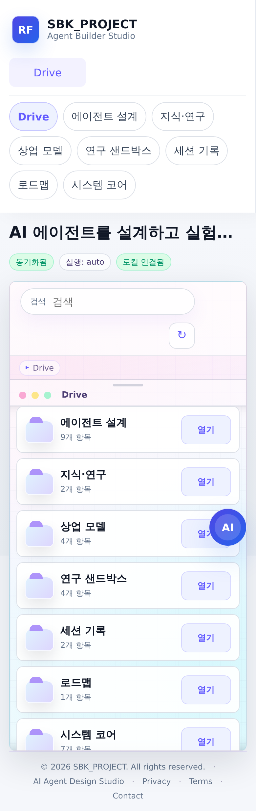
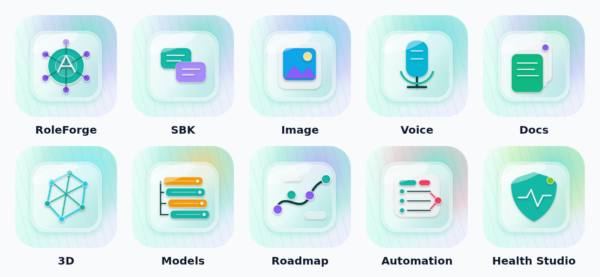
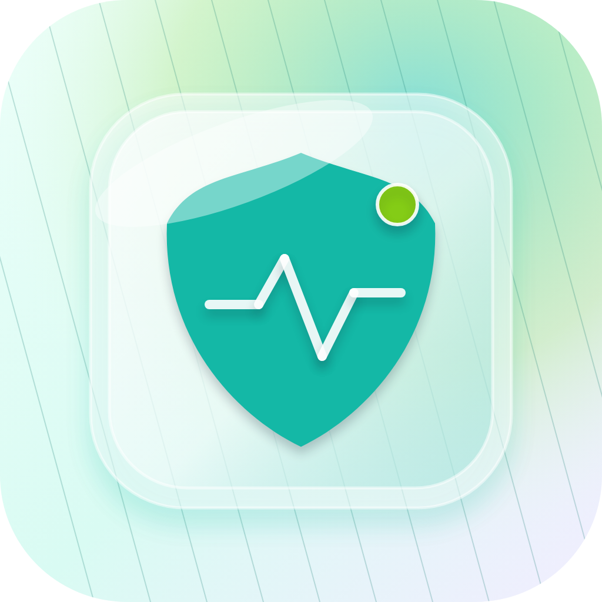

<div align="center">

# RoleForge

**A local-first AI agent workspace, automation console, and release-safety control plane.**

RoleForge brings role-based agents, model policy, RAG knowledge, document intake,
voice, OCR, image generation, 3D mesh workflows, Health Content Studio, mobile
Drive UX, and release safety into one responsive local workspace.


<sub>Web Drive workspace with grouped app shortcuts, automation console, Health Studio, and mobile/PWA shell.</sub>

</div>

---

## Portfolio Summary

RoleForge started from a practical local-AI problem: once a project uses more
than one model or modality, the workflow fragments across terminals, scripts,
runtime folders, generated artifacts, and safety notes.

The project reframes that as a control-plane problem. Chat, RAG, OCR, voice,
image generation, 3D mesh creation, model selection, health-content review, and
release safety all share a workspace, policy layer, typed automation runner,
artifact model, and audit path.

This repository is intentionally a **portfolio boundary**. It shows the product
direction, screenshots, architecture, safety posture, and latest milestone
without publishing private runtime logs, generated artifacts, local model
weights, or environment secrets.

## Current Milestones

- **RAG safety hardening**: RAG context is treated as untrusted retrieval context, with RAG-level eval metrics for hit, citation, and grounding proxy checks.
- **Health Content Studio**: a health-culture content planner and HealthCheck review tool for safer short-form health messaging.
- **Workspace app shell**: task-first Web Drive home, app registry, internal app windows, and mobile Drive behavior.
- **Unified app icons and PWA shell**: selected public UI assets for Drive shortcuts and mobile home-screen install.
- **Automation Console**: typed Agent Harness actions, runtime readiness, safe actions, audit events, and structured recovery output.
- **Tailscale mobile preview helper**: local-only phone testing through tailnet proxying, without public exposure.

## Product Highlights

| Area | What the project demonstrates |
|---|---|
| Agent operating model | Role profiles, safety rules, mode routing, provider chains, and per-agent knowledge boundaries |
| RAG workflow | Local document knowledge with eval coverage for retrieval, citations, and unsupported-claim checks |
| Health Studio | Content planning, overclaim detection, claim-literacy review, pose-literacy scope limits, and export |
| Workspace shell | Grouped app home, internal app windows, Drive model state, and mobile touch-scrolling |
| Automation Console | Typed Agent Harness, safe actions, readiness checks, audit events, and structured recovery |
| Release safety | PII, license, artifact, generated-output, and public-boundary checks before publication |

## Screenshots

### Workspace


### Mobile Drive



### Unified Icons



### Agent Registry


### Document Intake


### Release Safety


## Public UI Assets

<p align="center">
  
  
</p>

## Architecture at a Glance

```text
Web Drive Console
  -> Task-first Workspace Home
  -> Chat / Health Studio / Image / Voice / Document / 3D / Model / Roadmap apps
  -> Automation Console / Agent Harness / Runtime Readiness
  -> Agent Registry / Model Registry / Runtime Controls
  -> Review Queue + Release Safety

Runtime and Policy Layer
  -> Gate classification + domain modes
  -> Provider routing and runtime execution policy
  -> RAG indexing/search/eval
  -> Typed automation actions and audit events
  -> Local adapters for Ollama, OCR, STT/TTS, image, and 3D services
```

## Public Boundary

This portfolio repository does not include:

- `.env` files, tokens, API keys, or private config
- local model weights or Hugging Face caches
- session logs and generated runtime artifacts
- generated image, voice, document, review, audit, or 3D output data
- private roadmap notes or development work logs

Selected screenshots and icons are included as public UI assets. Runtime source
jobs, prompts, private documents, and generated output logs remain outside this
portfolio repository.

## Attribution

RoleForge can connect to third-party models and runtimes. Model weights and
external services are not included in this repository and remain subject to
their own licenses and terms.

See [Third-Party Notices](docs/THIRD_PARTY_NOTICES.md) for model, OCR, STT, TTS,
image, 3D, and runtime attribution.

## License

MIT. See [LICENSE](LICENSE).
